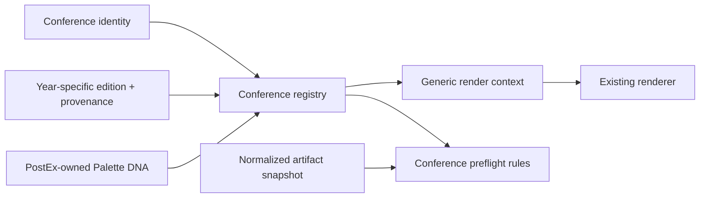
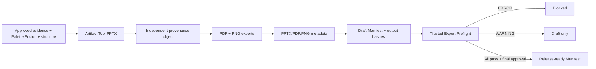
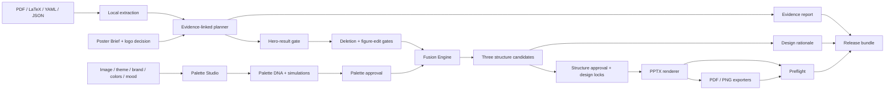

# PostEx™ v0.5 Architecture

## Conference Intelligence boundary

The v0.5 P0/P1 layer is data-first. `ConferenceRegistry` validates and joins stable conference identity, annual edition requirements, Conference Palette DNA, provenance, rights, and verification. `ConferencePreflightValidator` evaluates declarative rules against a normalized artifact snapshot. `ConferenceRenderContext` maps only generic canvas, theme, and layout tokens into the existing renderer contract; conference IDs never select renderer code paths.



Official requirements and organizer recommendations use `origin: official`, an explicit `required` or `recommended` level, and a valid `provenance_ref`. Design guidance uses `origin: postex` and `level: postex`. A partially verified edition lists every known gap rather than filling it from prior-year or third-party material.

## 0. Trusted Export boundary

Trusted Export is enforced in the shared core, not in Skill prose. `provenance` resolves legacy defaults and omission approvals; `manifest` records inputs, licensed materials, approvals, Preflight state, and output hashes; `generation` coordinates metadata and finalization; `artifact_renderer.mjs` creates the editable `POSTEX_PROVENANCE_MARK`; and `preflight` decides draft versus release-ready.



The Manifest never includes its own hash. Scientific source assets are read and hashed; visual provenance is composed as a separate poster object and never burned into source figure pixels.

## 1. Principles

- **One shared core.** CLI and both Skills call `postex`; prompts never reimplement business logic.
- **Evidence before aesthetics.** Stable claim and evidence IDs precede rewriting, translation, palette, and layout.
- **Palette is behavior.** Color roles, ratios, mood, components, and semantic locks form one design contract.
- **Structure is proposed, not assumed.** Three directions expose meaningful hierarchy choices.
- **Consequential changes are approved.** Upload, hero, deletion, figure edit, palette, structure, and semantic unlock use digest-bound gates.
- **Approved work can be locked.** Later revisions fail closed when they target locked elements.
- **PPTX remains canonical.** PDF and PNG are exports; reports remain separate inspectable artifacts.

## 2. Component flow



Cloud providers sit behind the local privacy gate and receive only `ApprovedCloudPayload`; they cannot open manuscript paths.

## 3. Package responsibilities

| Module | Responsibility |
|---|---|
| `brief` | Pre-generation interview contract and validation |
| `palette` | Legacy palette compatibility plus Palette DNA and palette approval |
| `fusion` | Hero selection, three structure candidates, recommendation, and structure approval |
| `figures` | Approved crop, split, recomposition, and caption-compression proposals |
| `locks` | Immutable user-owned design decisions |
| `rationale` | JSON-compatible design explanation and self-contained HTML output |
| `approvals` | Canonical digest, proposal, decision, revocation, and stale-record prevention |
| `privacy` | Redaction, disclosure, and approved cloud payload construction |
| `evidence` | Evidence registry and coverage checks |
| `research` | Bioinformatics and observational planning profiles |
| `templates` | Official family and size resolution |
| `renderers` | Editable PPTX authoring and PDF export boundaries |
| `provenance` | Stable source ID, visual-mark policy, omission approval, and file metadata |
| `manifest` | Trusted Export inventory, license/approval references, and SHA-256 records |
| `preflight` | Draft/release diagnostics, integrity verification, and publication gate |
| `conference` | Conference registry, schema composition, Palette DNA, and renderer tokens |
| `conference_preflight` | Declarative edition-rule evaluation against normalized artifact facts |
| `workflow` | v0.1 compatibility flow and v0.2 Palette Fusion flow |
| `cli` | Thin user-facing command surface |

## 4. Core v0.2 records

- `PosterBrief`: audience, takeaway, emphasis, must-keep items, permissions, branding, and visual intent.
- `PaletteDNA`: role colors, ratios, provenance, moods, component style, simulations, and semantic locks.
- `ContentSignals`: approved hero claim, principal visual, figure/table counts, and method complexity.
- `FusionCandidate`: direction, brief digest, palette ID, layout weights, component language, and rationale.
- `FigureEdit`: figure, operation, panels, reason, and label-preservation rule.
- `DesignLock`: target, target type, value digest, and actor.
- `ApprovalRecord`: subject, proposal ID, digest, decision, actor, and UTC timestamp.

Text may change through translation or layout, but IDs cannot be reused for different evidence or approval subjects.

## 5. State and invalidation

All approvals follow:

```text
no proposal → proposed → approved
                    ↘ rejected
approved → revoked
proposal changed → proposed with a new digest
```

The v0.2 design sequence is:

```text
local_ready → brief_ready
→ awaiting_hero_approval
→ awaiting_deletion_approval
→ awaiting_figure_approval
→ awaiting_palette_approval
→ awaiting_structure_approval
→ ready_to_render → rendered → preflight_passed
```

Cloud approval is an independent capability gate immediately before provider transmission. Changing the brief invalidates hero and all downstream design approvals. Changing the hero invalidates figure, palette-dependent structure, and rendering. Changing Palette DNA invalidates palette, structure, and rendering. Changing a candidate invalidates structure approval and rendering.

## 6. Fusion contract

`FusionEngine` is deterministic for a given brief, Palette DNA, and content signals. It produces Hero Result, Visual Journey, and Editorial Story. Candidates allocate normalized layout weights across hero, methods, results, and impact, then combine direction defaults with Palette DNA component rules.

The engine does not mutate figures, recolor raster science, or approve its own recommendation. Renderer integration consumes only an approved candidate.

## 7. Rendering and compatibility

Bioinformatics Pipeline, Observational Cohort, and Visual Results share the production renderer in A0, A1, and 36×48 landscape. v0.1–v0.3 `Palette`, `PosterWorkflow`, project files, approvals, evidence, and rendering inputs remain loadable. A project without `provenance` is interpreted as `enabled: true`.

PowerPoint is the preferred PDF exporter; LibreOffice is the declared fallback. Rasterized PNG is preview-only.

## 8. Security and licensing

Threats include manuscript prompt injection, accidental upload, stale approval replay, path traversal, malicious archives or PPTX macros, secret leakage, unlicensed visual inspiration, and silent mutation of approved content. Local parsing, allowlisted payloads, digest gates, explicit locks, provenance records, and independent asset licenses mitigate these risks.
