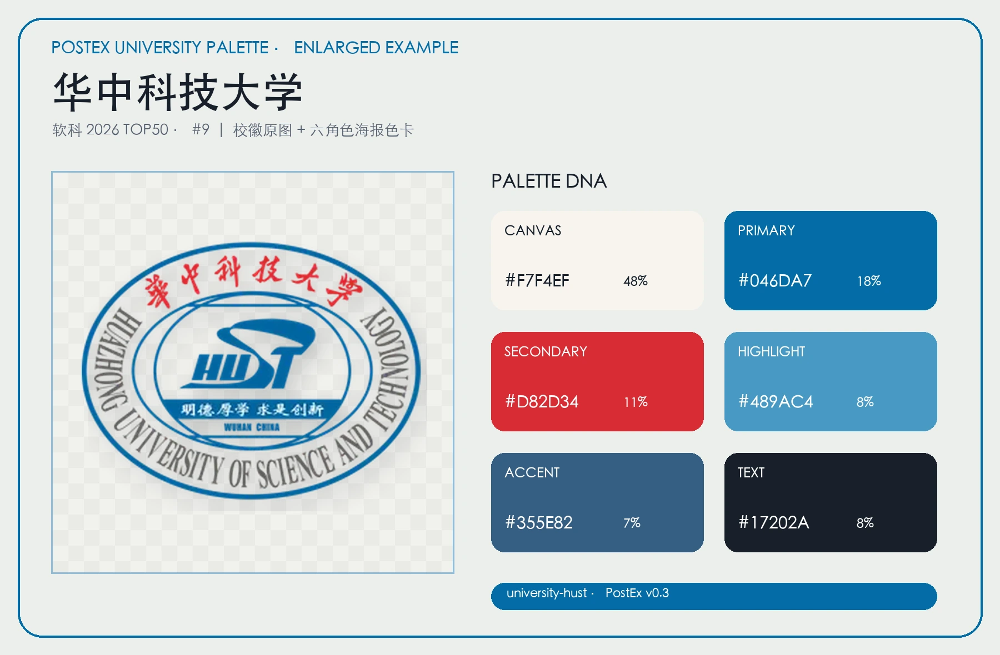
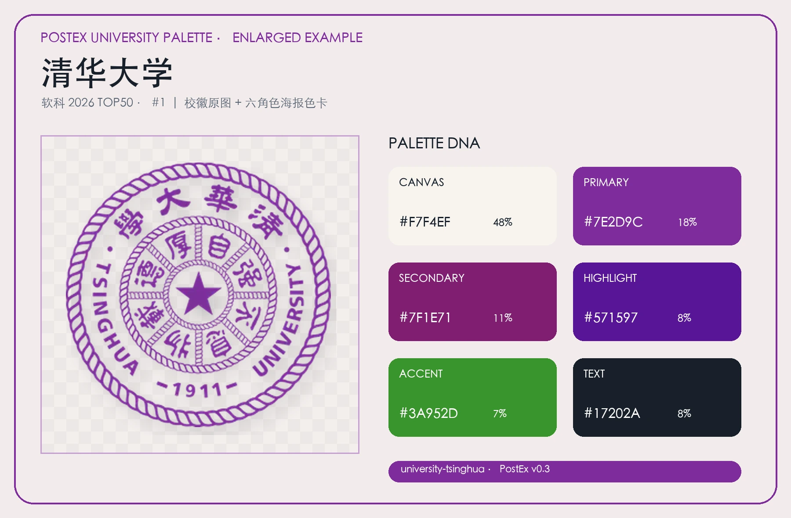
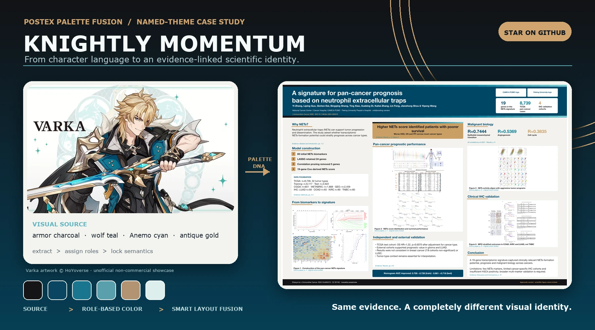
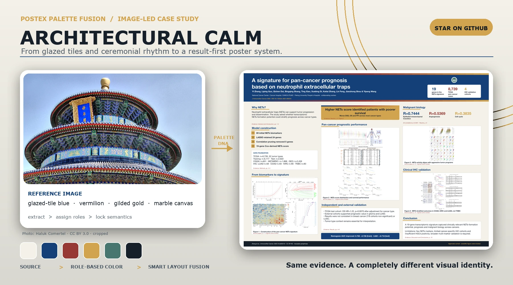
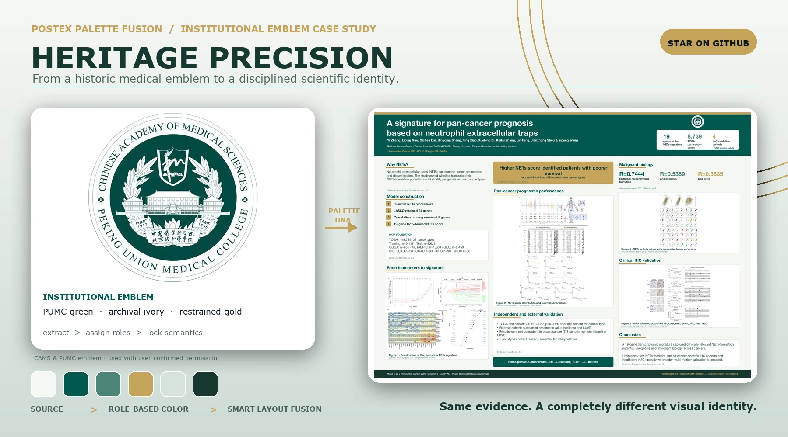

<p align="center">
  
</p>

<p align="center"><strong>Evidence-linked academic posters with a visual identity of their own.</strong></p>

PostEx™ is an open-source, agent-friendly academic-poster toolkit for Codex, Claude Code, and the command line. Version 0.4 adds **Trusted Export**: every generated poster is manifest-backed, approval-aware, integrity-checked, and preflighted without changing scientific image pixels. The curated 154-card palette library and Palette Fusion remain fully available.

The approved **Poster Frame** identity is available as an editable SVG brand kit with primary, horizontal, monochrome, reverse, favicon, and social-avatar variants. See the [PostEx brand system](docs/brand.md).

> Status: `0.4.0a1`. Bioinformatics Pipeline, Observational Cohort, and Visual Results are production-renderable in A0, A1, and 36×48 landscape. Trusted Export emits PPTX, PDF, PNG, Preflight, evidence, and `postex-manifest.json` artifacts with digest-bound release controls.

## Trusted Export

Trusted Export binds inputs, templates, palettes, licensed assets, approvals, and output hashes in `postex-manifest.json`. It records the PostEx version, project and source IDs, input hash, template and dimensions, Palette ID, asset/license references, approvals, Preflight result, and output hashes. The Manifest never hashes itself. Any ERROR blocks release; any WARNING keeps output draft-only.

## Built-in palette library

PostEx 0.3 includes 154 source-grounded cards, displayed as: 50 ShanghaiRanking 2026 Chinese university emblems, 50 foreign university emblems selected from the 2026–2027 U.S. News Best Global Universities ranking, 35 Genshin characters grouped by Mondstadt, Liyue, Inazuma, Sumeru, Fontaine, Natlan, and Nod-Krai, then 19 Chinese city photographic cards. Each card combines source art with a six-role, poster-ready palette and machine-readable provenance.

[](assets/palettes/previews/all-palettes.webp)

Two enlarged examples show how the emblem and semantic palette work together:

[](assets/palettes/examples/university-hust-example.webp)

[](assets/palettes/examples/university-tsinghua-example.webp)

See the [built-in palette documentation](docs/built-in-palettes.md) or audit a checkout with:

```bash
postex palette-catalog --root . --show-blockers
```

## See PostEx in action

### 1. Turn visual inspiration into Palette DNA

The primary visual direction on this page is a **Paimon-inspired cape-gradient Visual Signature**: midnight navy, layered cape blues, luminous ice blue, warm starlight gold, and a soft pearl canvas. No character artwork is bundled. PostEx translates the inspiration into an original, research-ready system of color roles, gradients, hierarchy, rhythm, cards, connectors, and emphasis.


PostEx can build Palette DNA through several complementary routes:

- **Natural-language recognition:** descriptions such as *celestial, friendly, refined, airy* are parsed into temperature, luminance, saturation, contrast, visual rhythm, hierarchy, and component behavior.
- **User-image recognition:** region-aware CIELAB sampling identifies dominant, supporting, and accent colors from meaningful image regions; contrast repair and print simulation turn them into usable poster roles instead of simply averaging pixels.
- **Named-theme interpretation:** a theme is abstracted into visual characteristics and a rights-safe design language; source character or game artwork is not required or redistributed.
- **Brand and manual input:** institutional or user-supplied colors are mapped to semantic roles, completed with accessible neutrals, and checked for contrast, grayscale, color-vision, and print behavior.

Every route records provenance and produces role-based colors, usage ratios, component behavior, semantic locks, and three approval-ready expression levels: **Academic Safe**, **Balanced Fusion**, and **Visual Signature**. The Paimon-inspired Visual Signature is the hero direction here; the other two demonstrate how the same evidence plan can support quieter alternatives. Open the generated [Palette Studio HTML](examples/palette-fusion/outputs/palette/palette-studio.html), inspect the [fusion candidates](examples/palette-fusion/outputs/fusion/fusion-candidates.json), or read the [design rationale](examples/palette-fusion/outputs/fusion/design-rationale.html).

### 2. Fuse a fictional paper with a signature visual identity

The AURORA-12 golden example starts from a fully fictional, CC0 five-page manuscript. Its primary output is the Paimon-inspired Visual Signature below: evidence-linked, editable, print-aware, and approval-bound from Palette DNA through final rendering.

[](examples/aurora-synthetic/output/paimon/aurora-synthetic-paimon-cape-gradient-visual-signature.png)

The same approved evidence plan can also be expressed through PostEx Academic Safe or a user-image Balanced Fusion. These are supporting comparisons, not the lead identity:

[](docs/images/aurora-three-palettes.png)

**Input:** [fictional manuscript PDF](examples/aurora-synthetic/AURORA-12-synthetic-manuscript.pdf) · **Research type:** synthetic bioinformatics benchmark · **Content mode:** traceable · **Primary output:** [Paimon-inspired PPTX](examples/aurora-synthetic/output/paimon/aurora-synthetic-paimon-cape-gradient-visual-signature.pptx) · **Supporting outputs:** [Academic Safe PPTX](examples/aurora-synthetic/output/default/aurora-synthetic-default-academic-safe.pptx) · [image-fusion PPTX](examples/aurora-synthetic/output/gate-image/aurora-synthetic-gate-image-balanced-fusion.pptx) · **Audit:** [evidence](examples/aurora-synthetic/evidence.json) · [approvals](examples/aurora-synthetic/approval-log.json)

### 3. Keep one design language across print sizes

The Paimon-inspired AURORA-12 design is rendered and preflighted independently in A0, A1, and 36×48-inch landscape formats rather than relying on blind page scaling. Typography, margins, cards, gradients, and figure density are adapted to each physical size while the Palette DNA remains recognizable.


### 4. Evaluate evidence structure across study types

Both panels below are generated from CC0 fictional studies: **AURORA-12** exercises a bioinformatics benchmark structure, while **LUMEN-24** exercises an observational cohort structure. They test must-keep facts, evidence anchors, source contracts, and interpretation boundaries—not just visual similarity—and share the Paimon-inspired design language used throughout this page.


Inspect the [AURORA-12 manuscript and evidence](examples/aurora-synthetic/) or the [LUMEN-24 fictional source and content plan](examples/homepage-fictional-evidence/).

### 5. Give one paper a knightly visual signature

What if a scientific poster could feel decisive, kinetic, and memorable—without sacrificing evidence discipline? This Varka-inspired case translates charcoal armor, wolf teal, Anemo cyan, ivory, and antique gold into a role-based **Visual Signature** with a clear results axis and restrained high-energy accents.

[](docs/images/showcase/varka-poster.png)

PostEx does not paste character art into the poster or recolor scientific figures. It abstracts the reference into hierarchy, contrast, rhythm, component behavior, and semantic color roles; the source figures remain pixel-locked while the surrounding design becomes unmistakably its own.

**Route:** named-theme interpretation + region-aware image sampling · **Palette:** Visual Signature · **Structure:** Visual Journey · **Full view:** [poster PNG](docs/images/showcase/varka-poster.png) · **Reference:** [HoYoverse-hosted Varka illustration](docs/images/showcase/sources/varka-official-illustration.png)

### 6. Turn architecture into an intelligent poster system

The Temple of Heaven case starts with a real photograph, but the outcome is not a photo-themed template. PostEx recognizes glazed-tile blue, vermilion structure, gilded details, jade-painted eaves, and pale stone—then turns those observations into a print-safe **Balanced Fusion** and a calm, result-first reading path.

[](docs/images/showcase/tiantan-poster.png)

The building's ceremonial axis becomes information flow; tiered roofs become restrained header rhythm; white stone becomes breathing space. The reference image shapes the design language without appearing inside the scientific poster itself.

**Route:** user-image recognition + semantic interpretation · **Palette:** Balanced Fusion · **Structure:** Visual Journey · **Full view:** [poster PNG](docs/images/showcase/tiantan-poster.png) · **Reference:** [Hall of Prayer for Good Harvests photograph](docs/images/showcase/sources/tiantan-hall-of-prayer.jpg)

### 7. Turn an institutional emblem into a scientific identity

The Peking Union Medical College (北京协和医学院) case begins with an authorized institutional emblem rather than a photograph or character reference. PostEx maps PUMC green, archival ivory, restrained gold, sage support and clinical white into a disciplined **Balanced Fusion** that feels institutional without turning the poster into a branded letterhead.

[](docs/images/showcase/pumc-poster.png)

The emblem appears as the approved institutional mark while the extracted palette controls hierarchy, cards, metrics and emphasis. Scientific raster figures remain unchanged, and no affiliation or endorsement beyond the source study is implied.

**Route:** permission-recorded emblem + brand-role extraction · **Palette:** Balanced Fusion · **Structure:** Visual Journey · **Full view:** [poster PNG](docs/images/showcase/pumc-poster.png) · **Reference:** [authorized CAMS & PUMC emblem](docs/images/showcase/sources/pumc-emblem.png)

## Your study should not look like everyone else's

Give PostEx a paper and a visual idea—a mood, a place, an image, a brand, or a few colors. It returns traceable content, approval-ready Palette DNA, intelligent layout fusion, an editable PPTX, print output, and the evidence trail behind every major decision.

**If you want academic software to be both trustworthy and visually ambitious, [star PostEx on GitHub](https://github.com/QD-academia/PostEx).**

> **Alpha boundary:** all three template families and sizes now render through the shared production backend. Palette Fusion still requires explicit selection and approval of a structural direction; `postex create` scaffolds these gates but never decides them for the user.

## What makes PostEx different

- **Palette DNA:** natural language, user images, named themes, brand colors, or manual colors become role-based systems with usage ratios, component language, provenance, simulations, and semantic locks.
- **Intelligent fusion:** Hero Result, Visual Journey, and Editorial Story proposals respond to both content and palette character.
- **Explainable design:** every fusion proposal states why it chose its visual anchor, structure, emphasis, and guardrails.
- **User-owned decisions:** cloud upload, deletion, figure editing, palette application, poster structure, and semantic-color unlock are digest-bound approvals.
- **Evidence first:** claim IDs and numerical evidence survive rewriting, translation, and visual redesign.
- **Editable and print-aware:** PPTX is canonical; PDF, PNG, preflight, evidence, and rationale reports accompany delivery.
- **Trusted by construction:** file metadata, Manifest hashes, integrity checks, and final-release approval are enforced by the shared core and renderer.

PostEx v0.4 prioritizes bioinformatics and observational biomedical research, Chinese/English input and output, and A0, A1, and 36×48-inch landscape posters.

## Quick start

```bash
python -m venv .venv
source .venv/bin/activate
pip install -e ".[dev]"

postex brief-questions
postex create path/to/paper.pdf --project-directory my-poster
postex validate examples/aurora-synthetic/project-paimon.yaml
postex palette-plan examples/palette-fusion/project.yaml
postex fusion-plan examples/palette-fusion/project.yaml
python -m unittest discover -s tests -v
python scripts/check_repository.py
```

The two design commands create:

```text
examples/palette-fusion/outputs/fusion/
├── fusion-candidates.json
└── design-rationale.html
examples/palette-fusion/outputs/palette/
├── palette-candidates.json
└── palette-studio.html
```

The end-to-end renderer is exercised by the synthetic golden example:

```bash
postex generate examples/aurora-synthetic/project-paimon.yaml \
  --artifact-workspace /path/to/initialized/artifact-tool-workspace \
  --office-executable /path/to/soffice
```

## Palette Fusion workflow

```text
local inspect
→ Poster Brief and logo decision
→ evidence-linked content plan
→ hero-result approval
→ deletion and figure-edit approvals
→ three Palette DNA previews
→ palette approval
→ three structural fusion directions
→ structure approval
→ PPTX/PDF/PNG render
→ file metadata + integrity hashes
→ dimensions, fonts, overflow, DPI, contrast, margin, overlap, integrity, and evidence preflight
→ final release approval
→ Manifest, evidence, approval, diff, and design-rationale reports
```

Changing an approved proposal changes its digest and invalidates the approval. Locked copy, figures, regions, colors, layouts, or logos cannot be silently changed in later iterations.

## Repository map

```text
src/postex/              shared Python core
schemas/                 v0.1–v0.4 compatible JSON contracts
configs/                 defaults and provider examples
skills/                  Codex and Claude Code skill drafts
assets/templates/        three families × three print sizes
examples/palette-fusion/ runnable design-intelligence example
examples/aurora-synthetic/ CC0 fictional golden example and three poster variants
tests/                   unit and contract tests
evals/                   quality cases plus 3-family × 3-size Trusted Export goldens
docs/                    workflows, privacy, rendering, and design contracts
docker/                  container packaging
```

## Compatibility and limits

v0.1–v0.3 project files remain loadable. All three template families render through the shared core, but a structure candidate still requires approval before use. Raster scientific figures are never recolored automatically. Editable SVG figure variants require a separate scientific-color unlock. Core runnable examples remain independent of proprietary character artwork; the clearly attributed homepage showcase assets are governed separately and are not covered by the repository's Apache-2.0 license.

## Licensing

Python code and documentation are Apache-2.0; see [LICENSE](LICENSE) and [NOTICE](NOTICE). Templates, examples, source papers, scientific figures, logos, character artwork, photographs, and homepage showcase assets have independent license records. See the [README image provenance](docs/images/README.md) before redistribution; never assume the code license covers bundled media.

See [PRD.md](PRD.md), [ARCHITECTURE.md](ARCHITECTURE.md), [SECURITY.md](SECURITY.md), and [CONTRIBUTING.md](CONTRIBUTING.md).
