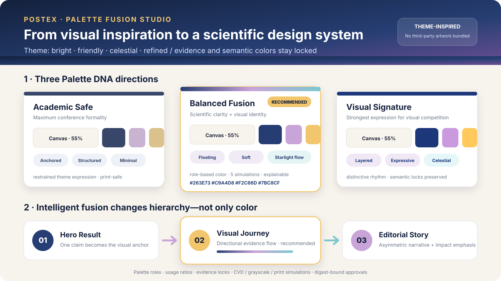
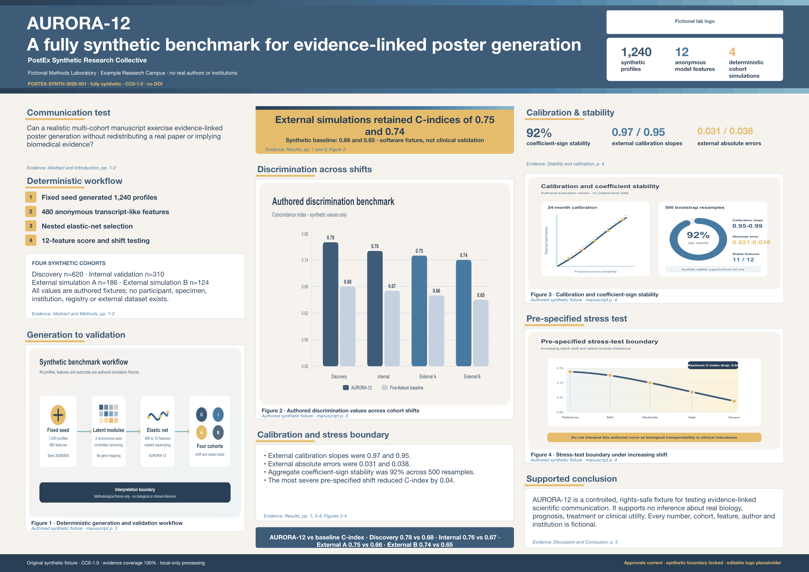
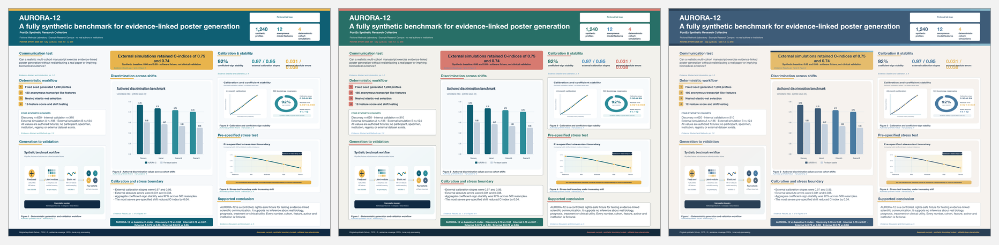
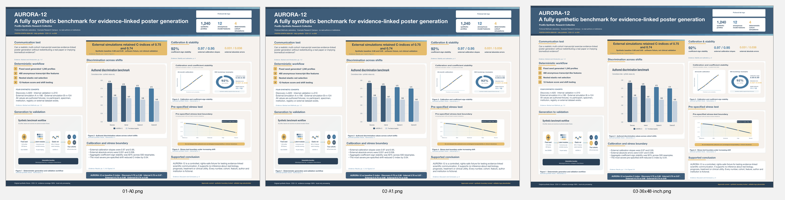
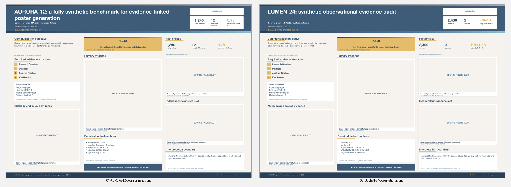

# PostEx

**Let every study have its own visual identity.**

PostEx is an open-source, agent-friendly academic-poster toolkit for Codex, Claude Code, and the command line. Version 0.2 introduces **Palette Fusion**: it combines evidence-linked scientific content with natural-language inspiration, reference images, named themes, brand systems, or manual colors to create a coherent poster identity—not merely a recolored template.

> Status: `0.2.0a2`. Palette DNA, Poster Brief, three-direction fusion planning, figure-edit approval, design locks, explainable rationale, and approval-bound Palette DNA rendering are runnable. The Bioinformatics Pipeline family remains the production-renderable family while the remaining template families are developed.

## See PostEx in action

### 1. Turn visual inspiration into Palette DNA

The primary visual direction on this page is a **Paimon-inspired cape-gradient Visual Signature**: midnight navy, layered cape blues, luminous ice blue, warm starlight gold, and a soft pearl canvas. No character artwork is bundled. PostEx translates the inspiration into an original, research-ready system of color roles, gradients, hierarchy, rhythm, cards, connectors, and emphasis.



PostEx can build Palette DNA through several complementary routes:

- **Natural-language recognition:** descriptions such as *celestial, friendly, refined, airy* are parsed into temperature, luminance, saturation, contrast, visual rhythm, hierarchy, and component behavior.
- **User-image recognition:** region-aware CIELAB sampling identifies dominant, supporting, and accent colors from meaningful image regions; contrast repair and print simulation turn them into usable poster roles instead of simply averaging pixels.
- **Named-theme interpretation:** a theme is abstracted into visual characteristics and a rights-safe design language; source character or game artwork is not required or redistributed.
- **Brand and manual input:** institutional or user-supplied colors are mapped to semantic roles, completed with accessible neutrals, and checked for contrast, grayscale, color-vision, and print behavior.

Every route records provenance and produces role-based colors, usage ratios, component behavior, semantic locks, and three approval-ready expression levels: **Academic Safe**, **Balanced Fusion**, and **Visual Signature**. The Paimon-inspired Visual Signature is the hero direction here; the other two demonstrate how the same evidence plan can support quieter alternatives. Open the generated [Palette Studio HTML](examples/palette-fusion/outputs/palette/palette-studio.html), inspect the [fusion candidates](examples/palette-fusion/outputs/fusion/fusion-candidates.json), or read the [design rationale](examples/palette-fusion/outputs/fusion/design-rationale.html).

### 2. Fuse a fictional paper with a signature visual identity

The AURORA-12 golden example starts from a fully fictional, CC0 five-page manuscript. Its primary output is the Paimon-inspired Visual Signature below: evidence-linked, editable, print-aware, and approval-bound from Palette DNA through final rendering.

[](examples/aurora-synthetic/output/paimon/aurora-synthetic-paimon-cape-gradient-visual-signature.png)

The same approved evidence plan can also be expressed through PostEx Academic Safe or a user-image Balanced Fusion. These are supporting comparisons, not the lead identity:

[](docs/images/aurora-three-palettes.png)

**Input:** [fictional manuscript PDF](examples/aurora-synthetic/AURORA-12-synthetic-manuscript.pdf) · **Research type:** synthetic bioinformatics benchmark · **Content mode:** traceable · **Primary output:** [Paimon-inspired PPTX](examples/aurora-synthetic/output/paimon/aurora-synthetic-paimon-cape-gradient-visual-signature.pptx) · **Supporting outputs:** [Academic Safe PPTX](examples/aurora-synthetic/output/default/aurora-synthetic-default-academic-safe.pptx) · [image-fusion PPTX](examples/aurora-synthetic/output/gate-image/aurora-synthetic-gate-image-balanced-fusion.pptx) · **Audit:** [evidence](examples/aurora-synthetic/evidence.json) · [approvals](examples/aurora-synthetic/approval-log.json)

### 3. Keep one design language across print sizes

The Paimon-inspired AURORA-12 design is rendered and preflighted independently in A0, A1, and 36×48-inch landscape formats rather than relying on blind page scaling. Typography, margins, cards, gradients, and figure density are adapted to each physical size while the Palette DNA remains recognizable.



### 4. Evaluate evidence structure across study types

Both panels below are generated from CC0 fictional studies: **AURORA-12** exercises a bioinformatics benchmark structure, while **LUMEN-24** exercises an observational cohort structure. They test must-keep facts, evidence anchors, source contracts, and interpretation boundaries—not just visual similarity—and share the Paimon-inspired design language used throughout this page.



Inspect the [AURORA-12 manuscript and evidence](examples/aurora-synthetic/) or the [LUMEN-24 fictional source and content plan](examples/homepage-fictional-evidence/).

> **Alpha boundary:** the full-size AURORA-12 posters use one approved Visual Journey structure in the production-renderable Bioinformatics Pipeline family. Palette Fusion also generates three structural candidates and rationale; rendering every structural direction and every template family is still in development.

## What makes PostEx different

- **Palette DNA:** natural language, user images, named themes, brand colors, or manual colors become role-based systems with usage ratios, component language, provenance, simulations, and semantic locks.
- **Intelligent fusion:** Hero Result, Visual Journey, and Editorial Story proposals respond to both content and palette character.
- **Explainable design:** every fusion proposal states why it chose its visual anchor, structure, emphasis, and guardrails.
- **User-owned decisions:** cloud upload, deletion, figure editing, palette application, poster structure, and semantic-color unlock are digest-bound approvals.
- **Evidence first:** claim IDs and numerical evidence survive rewriting, translation, and visual redesign.
- **Editable and print-aware:** PPTX is canonical; PDF, PNG, preflight, evidence, and rationale reports accompany delivery.

PostEx v0.2 still prioritizes bioinformatics and observational biomedical research, Chinese/English input and output, and A0, A1, and 36×48-inch landscape posters.

## Quick start

```bash
python -m venv .venv
source .venv/bin/activate
pip install -e ".[dev]"

postex brief-questions
postex validate examples/aurora-synthetic/project-paimon.yaml
postex palette-plan examples/palette-fusion/project.yaml
postex fusion-plan examples/palette-fusion/project.yaml
python -m unittest discover -s tests -v
python scripts/check_repository.py
```

The two design commands create:

```text
examples/palette-fusion/outputs/fusion/
├── fusion-candidates.json
└── design-rationale.html
examples/palette-fusion/outputs/palette/
├── palette-candidates.json
└── palette-studio.html
```

The end-to-end renderer is exercised by the synthetic golden example:

```bash
postex generate examples/aurora-synthetic/project-paimon.yaml \
  --artifact-workspace /path/to/initialized/artifact-tool-workspace \
  --office-executable /path/to/soffice
```

## Palette Fusion workflow

```text
local inspect
→ Poster Brief and logo decision
→ evidence-linked content plan
→ hero-result approval
→ deletion and figure-edit approvals
→ three Palette DNA previews
→ palette approval
→ three structural fusion directions
→ structure approval
→ PPTX/PDF/PNG render
→ distance, accessibility, print, and evidence preflight
→ evidence, approval, diff, and design-rationale reports
```

Changing an approved proposal changes its digest and invalidates the approval. Locked copy, figures, regions, colors, layouts, or logos cannot be silently changed in later iterations.

## Repository map

```text
src/postex/              shared Python core
schemas/                 v0.1-compatible and v0.2 JSON contracts
configs/                 defaults and provider examples
skills/                  Codex and Claude Code skill drafts
assets/templates/        three families × three print sizes
examples/palette-fusion/ runnable design-intelligence example
examples/aurora-synthetic/ CC0 fictional golden example and three poster variants
tests/                   unit and contract tests
evals/                   quality cases and rubric
docs/                    workflows, privacy, rendering, and design contracts
docker/                  container packaging
```

## Compatibility and limits

v0.1 project files remain loadable. The v0.2 alpha generates fusion plans and rationale through the shared Python core; it does not yet promise that all three fusion directions can be rendered by every template family. Raster scientific figures are never recolored automatically. Editable SVG figure variants require a separate scientific-color unlock. Named-theme examples include no proprietary character artwork or third-party brand assets.

## Licensing

Python code and documentation are Apache-2.0; see [LICENSE](LICENSE) and [NOTICE](NOTICE). Templates and examples have independent license records. Never assume the code license covers source papers, figures, logos, fonts, character artwork, or palette reference images.

See [PRD.md](PRD.md), [ARCHITECTURE.md](ARCHITECTURE.md), [SECURITY.md](SECURITY.md), and [CONTRIBUTING.md](CONTRIBUTING.md).
