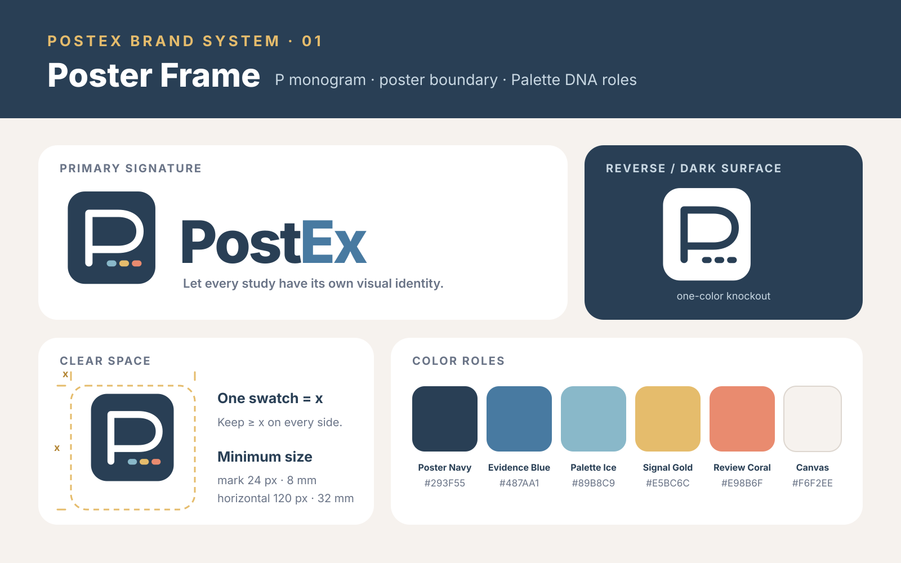

# PostEx™ brand system

The official PostEx™ identity is the **Poster Frame**: a geometric `P` inside a poster-shaped boundary, followed by three small Palette DNA swatches. The mark connects the product name, the academic-poster canvas, and role-based visual identity in one compact shape.

## Logo files

| Asset | Intended use |
|---|---|
| [`postex-logo-primary.svg`](../assets/brand/postex-logo-primary.svg) | Repository pages, documentation covers, launch graphics, and wide layouts with room for the tagline |
| [`postex-logo-horizontal.svg`](../assets/brand/postex-logo-horizontal.svg) | Poster footers, PPTX masters, navigation bars, and compact headers |
| [`postex-mark-frame.svg`](../assets/brand/postex-mark-frame.svg) | App icon, GitHub avatar, profile image, and square placements |
| [`postex-mark-monochrome.svg`](../assets/brand/postex-mark-monochrome.svg) | One-color printing, embossing, engraving, stamps, and restricted production |
| [`postex-mark-reverse.svg`](../assets/brand/postex-mark-reverse.svg) | Dark backgrounds where the full-color mark loses contrast |
| [`favicon.svg`](../assets/brand/favicon.svg) | Browser favicon and very small digital placements |
| [`postex-social-avatar.svg`](../assets/brand/postex-social-avatar.svg) | Social profile image and repository organization avatar |

SVG is the master format. PNG exports are derivatives and should be regenerated from these source files rather than edited directly.

## Color roles

| Role | Hex | Use |
|---|---|---|
| Poster Navy | `#293F55` | Master mark, primary text, and structural surfaces |
| Evidence Blue | `#487AA1` | `Ex` wordmark and evidence-linked interaction accents |
| Palette Ice | `#89B8C9` | First Palette DNA swatch; cool support |
| Signal Gold | `#E5BC6C` | Second Palette DNA swatch; selected or recommended states |
| Review Coral | `#E98B6F` | Third Palette DNA swatch; review and attention states |
| Canvas Ivory | `#F6F2EE` | Warm presentation canvas and social-avatar background |

Poster Navy is always the dominant brand color. The three swatches remain secondary accents; do not enlarge them into equal-weight stripes or recolor the `P` independently.

## Clear space and minimum size

Keep clear space equal to at least one palette-swatch width around every side of the mark. Nothing—including type, a trim edge, a partner logo, or a photograph's focal detail—should enter this area.

- Frame mark: minimum `24 px` on screen or `8 mm` in print.
- Horizontal logo: minimum `120 px` on screen or `32 mm` in print.
- Primary logo with tagline: minimum `260 px` on screen or `70 mm` in print.
- Below the primary-logo minimum, use the horizontal logo without the tagline.

## Background and production rules

- Use the full-color mark on white, Canvas Ivory, or another quiet light background.
- Use the reverse mark on Poster Navy or dark photography. Keep the area behind it visually calm.
- Use the monochrome asset when only one ink or material is available.
- Do not rotate, stretch, add effects, change the corner radius, rearrange the swatches, or place the mark inside another container.
- Do not use the three swatches alone as a substitute for the mark.

## Typography

The editable wordmark lockups use **Inter ExtraBold** with Arial as the compatibility fallback. Product copy should use Inter where available. If Inter cannot be embedded, use Arial or another neutral sans-serif without altering the Frame mark.

## Naming, trademark notice, and accessibility

Write the product name as `PostEx`, with capital `P` and `E`. Use `PostEx™` on the first prominent brand occurrence in repository pages, launch graphics, marketing pages, and other public-facing material; subsequent prose may use `PostEx`. Do not append `™` to commands, package names, filenames, URLs, metadata keys, or ordinary repeated mentions.

The `™` symbol indicates a trademark claim and does not state that the mark is registered. Never use `®` unless and until the relevant trademark office has issued a registration. The `™` symbol is not part of the underlying name or any future application specimen.

Use the full name in alt text: “PostEx™ — Let every study have its own visual identity.” The icon's accessible description is: “A geometric P inside a poster frame with three Palette DNA swatches.”
