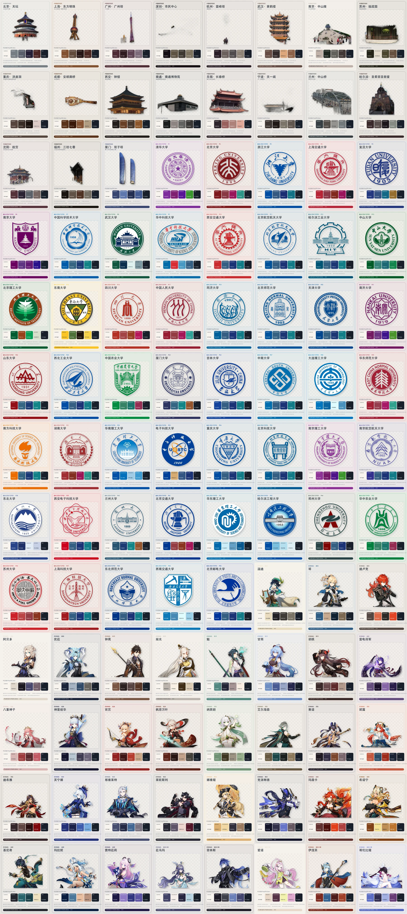

# Built-in palette packs

Version 0.3 introduces a rights-gated catalog for 104 visual palettes:

- 19 Chinese city landmark palettes requested for Beijing, Shanghai, Guangzhou,
  Shenzhen, Hangzhou, Wuhan, Nanjing, Suzhou, Chongqing, Chengdu, Xi'an, Nantong,
  Wuxi, Ningbo, Lanzhou, Harbin, Shenyang, Fuzhou, and Xiamen.
- The Top 50 entries in the 2026 ShanghaiRanking Chinese Universities Ranking
  (main ranking), published 15 April 2026.
- 35 Genshin character inspirations: five each for Mondstadt, Liyue, Inazuma,
  Sumeru, Fontaine, Natlan, and Nod-Krai.

The catalog reserves stable IDs before artwork is acquired. Each card uses an
alpha-transparent PNG and a palette extracted from that exact PNG. The source PNG
digest is stored beside the Palette DNA output so a later image replacement cannot
silently retain stale colors.

Rendered 900×1240 WebP cards are stored under `assets/palettes/cards/`, with
collection contact sheets under `assets/palettes/previews/`. The standalone release
archive includes the cutouts, extracted palettes, rendered cards, previews, rights
manifest, attribution, source receipts, and a per-file SHA-256 manifest.



## Preparing an approved asset

Only run this command after the source and redistribution terms have been recorded
in `assets/palettes/rights.yaml`:

```bash
python scripts/prepare_palette_asset.py \
  city-beijing-temple-of-heaven /path/to/approved-transparent-source.png
```

For an image on a genuinely uniform background, the local chroma-key option can be
used:

```bash
python scripts/prepare_palette_asset.py \
  city-beijing-temple-of-heaven /path/to/approved-source.png \
  --chroma '#FFFFFF' --threshold 20
```

The processor rejects undersized images, images without real transparency, empty
cutouts, and sources that do not contain enough distinguishable colors.

## Release audit

```bash
postex palette-catalog --root . --show-blockers
```

The command returns a non-zero status until every selected entry has a complete
rights record, a transparent cutout, and an extracted palette.

## Rebuilding cards and the release archive

```bash
PYTHONPATH=src python scripts/render_builtin_palette_cards.py
PYTHONPATH=src python scripts/build_palette_archive.py
```

The archive is written to `dist/postex-built-in-palettes-v0.3.0a1.zip`, together
with a `.sha256` checksum file.

